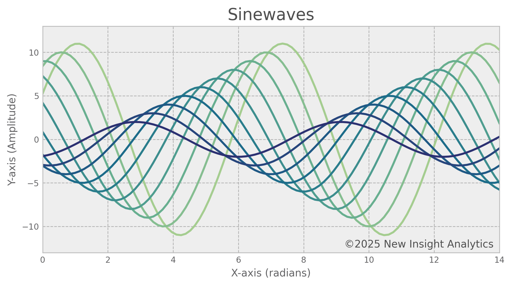

# Custom Charts
This package provides a quick and easy way to set custom global defaults for [Matplotlib](https://matplotlib.org/) styles. Create a unique style that works seamlessly across [Codespaces](https://github.com/features/codespaces), virtual environments or cloud-based Jupyter instances.

Matplotlib is a powerful and flexible visualization tool that is widely used for creating interactive plots in Python. However, the configuration can be confusing and difficult to transfer to some development environments. This package centralizes the styling and configuration of charts into reusable functions, making it easier to focus on generating insights. No more repetitive code or inconsistent visuals- just clean, professional charts with minimal effort.

 

    

 

# Requirements
- matplotlib.pyplot
- seaborn

 

# Installation
To install the package, use the following command:

`pip install git+https://github.com/awault/custom_charts.git`

 

# Usage
Once the package is installed, import it and apply your custom style:

    import matplotlib.pyplot as plt
    import seaborn as sns
    import custom_charts as cc

    # Call Function for Custom Style
    cc.set_custom_style()

You can also add a text watermark to your charts to provide attribution or prevent unauthorized use. The syntax to create a chart with pyplot remains the same- just call the `cc.add_watermark()` function.

    plt.scatter(x_values,y_values)
    plt.title("Scatterplot")
    cc.add_watermark()
    plt.ylim(ymin=0,ymax=20)
    plt.show()

 

# Customization
To create your own unique style, update the settings in the `set_custom_style()` function, located in `/custom_charts/__init__.py`. Here you can select a [style sheet](https://matplotlib.org/stable/gallery/style_sheets/style_sheets_reference.html) or combine with your own `.mplstyle` file for a base style. Although many custom parameters can be set within the `.mplstyle` file, certain parameters (such as figure size and label colors) can only be adjusted with runtime configuration parameters [(rcParams)](https://matplotlib.org/stable/users/explain/customizing.html#).

    Examples

    # Set Default Figure Size
    plt.rcParams['figure.figsize'] = (8,4)

    # Set Title Color
    plt.rcParams['axes.titlecolor'] = '#4f4f4f'

